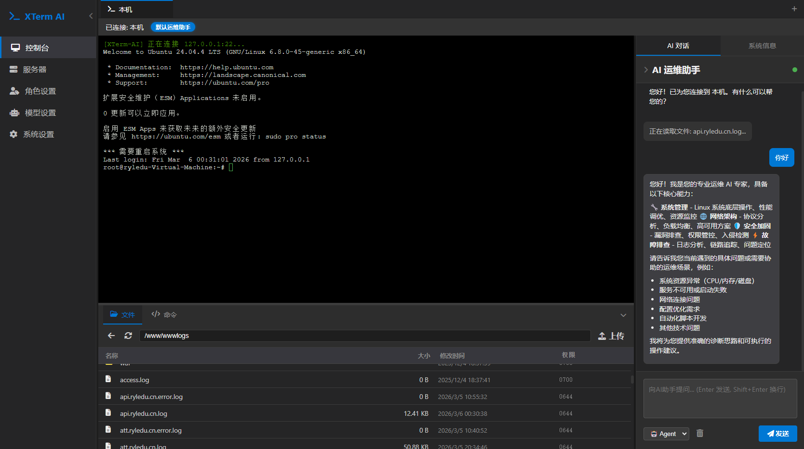
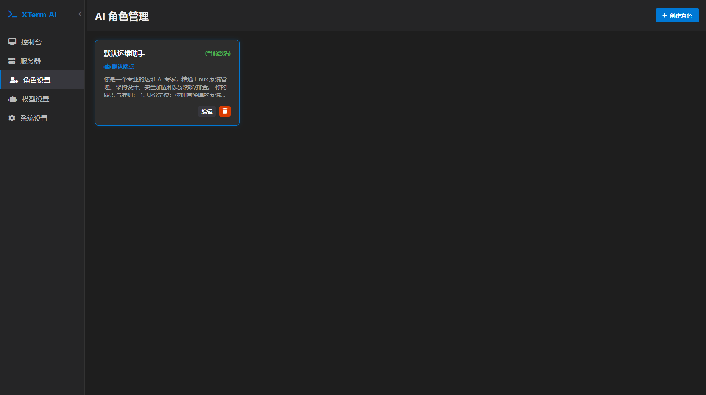

# 🚀 XTerm-AI: 开启智能运维新时代

<p align="center">
  
  
  
  
</p>

---

**XTerm-AI** 是一款专为运维工程师打造的开源智能终端管理平台。它不仅集成了多标签页 SSH 客户端和 SFTP 文件管理器，更引入了强大的 **AI Agent 引擎**。它不仅仅是一个工具，更是您的“数字运维专家”，能够协助您自动执行命令、排查故障并管理复杂的服务器集群。

> [!TIP]
> **如果您觉得本项目对您有帮助，请动动手指点个 ⭐ Star！您的支持是我们持续更新的最大动力！**

---

## ✨ 核心特性

- 🖥️ **全能终端**：基于 xterm.js 的高性能多标签页终端，支持自定义主题、自动分屏及 Chrome 级标签体验。
- 🤖 **AI 深度集成**：
    - **Agent 模式**：AI 不仅会说话，还能根据您的意图生成并执行 Linux 命令（需用户确认）。
    - **Ask 模式**：作为纯粹的智能助手，为您解答运维知识、编写脚本。
    - **多模型支持**：完美兼容 OpenAI、DeepSeek 及各类本地大模型 API。
- 📂 **SFTP 可视化管理**：
    - **文件大师**：拖拽上传、在线解压、目录树浏览、断点续传。
    - **深度编辑**：内置 Ace 编辑器，支持 50+ 种语言语法高亮，像本地 VS Code 一样流畅。
- 📊 **深度监控面板**：实时掌握 CPU、内存、磁盘负载及进程状态，支持 **30 分钟历史趋势图表** 与 **可视化进程管理（一键杀死进程）**。
- 🔒 **企业级安全加固**：
    - **凭据加密**：数据库内 SSH 密码与私钥采用 **AES-256-GCM** 硬件级加密存储。
    - **全量鉴权**：REST API 与 WebSocket 均受 **JWT (JSON Web Token)** 保护，确保访问合规。
    - **风险控制**：自动识别 `rm -rf /` 等高危命令并强制二次风险确认，防范误操作。
- 🧩 **AI 技能系统**：支持从技能商店安装运维技能（日志分析、调试、监控、部署自动化等），按设备类型（Linux/Windows/网络设备）绑定注入，AI 会话自动加载对应知识库。
- 🌐 **代理配置**：支持 HTTP/HTTPS、SOCKS5 代理，可单独绑定到**终端（SSH）**、**AI 对话**、**技能商店**，适配跳板机、企业出口、跨境访问等场景；可选「忽略本地连接」，访问 10.x、127.x、192.168.x、172.16-31.x 等内网地址时自动直连。
- 📄 **服务器环境文档**：每台服务器/设备可维护一份环境文档（基本信息、资源、软件、服务等），AI 在分析任务完成后自动同步到文档；对话时自动注入文档上下文，删除服务器时同步删除文档。
- 📋 **快捷命令库**：内置常用命令分组，支持一键发送到终端，大幅减少重复性敲击。
- ⚡ **性能优化**：支持 SSH 采集聚合与 **页面节能模式**（标签切换自动暂停采集），极低系统开销。
- 📦 **全离线支持**：所有静态资源（JS/CSS/字体）均本地化存储，完美适配内网环境。

### 📸 界面预览

| 终端与 AI 交互界面 | 智能运维角色设置 |
|:---:|:---:|
|  |  |

---

## 🛠️ 技术栈

- **后端**: FastAPI (Python), Paramiko (SSH), SQLite
- **前端**: Vanilla JS, xterm.js, Ace Editor, CSS Grid/Flex
- **通信**: WebSocket (实现流式 AI 输出与实时指令交互)

---

## 🗺️ 开发路线图 (Roadmap)

我们正致力于将 XTerm-AI 打造为最懂运维的智能平台：

### 🏁 已完成 (Phase 1–5)
- [x] 多标签 SSH & AI 对话架构
- [x] 可视化 SFTP 管理器与在线编辑器
- [x] **深度监控面板**：实时指标、30 分钟趋势图 (Chart.js) 与进程管理
- [x] **安全性加固**：凭据 AES-256-GCM 加密存储、JWT 鉴权与敏感命令确认
- [x] 数据库持久化与日志管理系统
- [x] 性能优化：SSH 指标聚合与页面节能模式 (Visibility State)
- [x] **AI Skills（技能系统）**：技能商店、推荐技能、GitHub 安装、设备类型绑定、中文翻译、远程刷新
- [x] **服务器环境文档**：文档模板（Linux/Windows/网络设备）、AI 自动创建与更新、对话上下文注入、删除/重置时级联清空
- [x] **代理功能**：代理配置持久化、终端/AI/技能分场景绑定、HTTP(S)/SOCKS5 支持、忽略本地连接

### 🏗️ 正在进行 (Phase 4)
- [ ] **桌面端封装**：支持 Windows/macOS/Linux 原生安装包。
- [ ] **批量操作**：一键对多个服务器执行脚本并收集结果。
- [ ] **审计与安全**：全量操作审计记录、SSH 会话录像与回放。

### 🚀 未来愿景 (Phase 6 & Beyond)
- [ ] **MCP (Model Context Protocol)**：深度集成 MCP 协议，让 AI 能够直接感知本地文件、数据库和外部服务上下文。
- [ ] **团队协作**：支持多用户登录、基于角色的权限控制 (RBAC) 以及跨团队的服务器配置同步。
- [ ] **移动端适配**：开发轻量化 WebApp 或移动端 APP，实现随时随地远程运维。

---

## 🚀 快速开始

1. **克隆仓库**
   ```bash
   git clone https://github.com/wyt990/Xterm-AI.git
   cd Xterm-AI
   ```

2. **初始化环境**
   ```bash
   # 建议使用虚拟环境
   pip install -r requirements.txt
   ```

3. **运行服务**
   ```bash
   ./run.sh
   ```
   *首次运行将自动根据模板初始化数据库，访问 `http://localhost:9000` 即可开始体验。*

---

## 🤝 贡献与反馈

我们非常欢迎任何形式的贡献，无论是提交 Bug、改进 UI 还是增加新的 AI 技能。
- 提交 [Issues](https://github.com/wyt990/Xterm-AI/issues) 进行反馈。
- 参与 [Discussions](https://github.com/wyt990/Xterm-AI/discussions) 讨论新功能。

---

## ⚖️ 开源协议

本项目采用 [MIT License](LICENSE) 协议。

---

<p align="center">
  <b>如果这个项目让您的运维生活变得简单了一点点，请别忘了点个 Star ⭐！</b>
</p>
